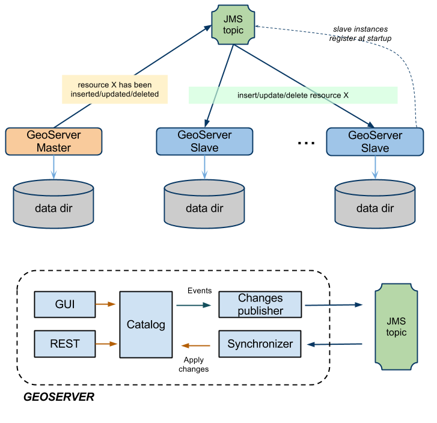
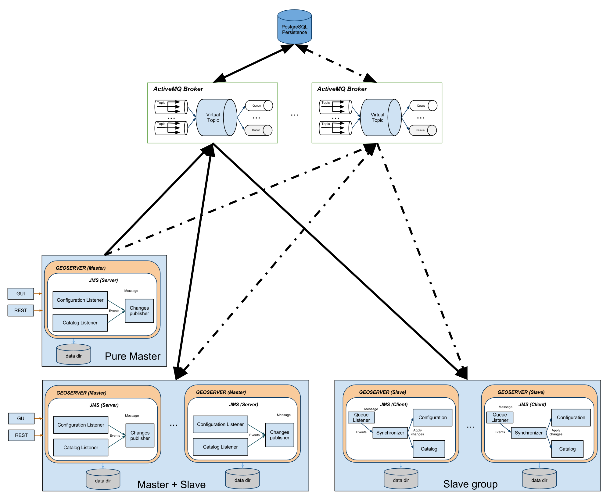

Clustering
========== 

Introduction
------------

There exists various approaches with GeoServer to implement a clustered deployment, based on different mixes of data directory sharing plus configuration reload. However, these techniques have intrinsic limitations in terms of scalability therefore we decided to create a specific GeoServer Clustering Extension in order to overcome them. It is worth to point out that what we are going to describe is designed to work with GeoServer 2.1 stable series as well as with the 2.2.x. Our approach is shown in Illustration .

We have implemented a robust Master/Slave approach which leverages on a Message Oriented Middleware (MOM) where:
The Masters (yes, we can have more than one, read on...) accept changes to the internal configuration, persist them on their own data directory but also forward them to the Slaves via the MOM
The Slaves should not be used to change  their configuration from either REST or the User Interface, since are configured to inject configuration changes disseminated by the Master(s) via the MOM
The MOM is used to make the Master and the Slave exchange messages in a durable fashion
Each Slave has its own data directory and it is responsible for keeping it aligned with the Master's one. In case a Slave goes down when it goes up again he might receive a bunch of JMS messages to align its configuration to the Master's one.
A Node can be both Master and Slave at the same time, this means that we don't have a single point of failure, i.e. the Master itself

Summarizing, the Master as well as each Slave use a private data directory, Slaves receive changes from the Master, which is the only one where configuration changes are allowed, via JMS messages. Such messages transport GeoServer configuration objects that the Slaves inject directly in their own in-memory configuration and then persist on disk on their data directory, completely removing the need for a configuration reload for each configuration change.

Description
-----------

The GeoServer Master/slave integration is implemented using JMS, Spring and a MOM (Message Oriented Middleware), in particular ActiveMQ.
The schema in Illustration  represents a complete high level design of Master/Slave platform.
It is composed by 3 distinct actors:
1. GeoServer Masters
2. GeoServer Slaves
3. The MOM (ActiveMQ)

This structure allows to have:
1. Queue fail-over components (using MOM).
2. Slaves down are automatically handled using durable topic (which will keep missed message to re-synch changes happens during the slave down).
3. Master down will not affect any slave synchronization process.

This deployment is composed by:
A pure Master GeoServer(s), this instance can only send events to the topic.It cannot act as a slave
A set of Geoserver which can work as both Master and Slave. These instances can send and receive messages to/from the topic. They can work as Masters (sending message to other subscribers) as well as Slaves (these instances are also subscribers of the topic).
A set of pure Slaves GeoServer instances whic can only receive messages from the topic.
A set of MOM brokers so that each GeoServer instance is configured with a set of available brokers (failover). Each broker use the shared database as persistence. Doing so if a broker fails for some reason, messages can still be written and read from the shared database.

All the produced code is based on spring-jms to ensure portability amongs different MOM, but if you look at the schema, we are also leveraging ActiveMQ VirtualTopics to get dinamic routing (you can dinamically attach masters and slaves).

The VirtualTopics feature has also other advantages explained here http://activemq.apache.org/virtual-destinations.html

All the ActiveMQ specific components are loaded using spring context so it will be easy to change the used MOM (if using ActiveMQ is not possible/desirable).

The implemented module is splitted using 2 separated profiles (using maven):
1. jms-server (used by the GeoServer Masters)
Provides a set of GeoServer event listeners (actually this is done for configuration and catalog).
Define a set of classes and methods to serialize or wrap those events to produce valid JMS messages.
For each incoming event type the module will apply the assigned method (from the above set) obtaining a valid JMS message.
Each generated message is sent to a durable topic queue.

2. jms-client (used on the GeoServer Slaves)
Provide a MessageListener which is used to consume messages from the topic (see above).
Define a set of classes and methods to perform message de-serialization accordingly to the incoming message type and properties.
For each incoming message the module will apply the assigned method (from the above set) obtaining a valid Object (f.e.: CatalogEvent).
The object will be used to apply changes to the target component (for instance the configuration or the catalog).

It is however possible as indicated above that an instance of  GeoServer would work both as master as well as Slave (looking at events coming from other GeoServer(s)). This is useful to setup a multimaster enviroment that allows the modification to keep flowing even in face of failure of one of the masters (using a failover approach).

HOWTO configure ActiveMQ broker
IP Address to bind to
Once deployed the activemq.war into tomcat be sure to configure the broker IP address and the datasource settings.

Edit the ApplicationContext.xml file deployed to activemq/WEB-INF/classes/ApplicationContext.xml:

.. code-block:: xml

  ...
  <!-- The transport connectors expose ActiveMQ over a given protocol to 
	clients and other brokers. 
	For more information, see: http://activemq.apache.org/configuring-transports.html -->
  <transportConnectors>
	  <transportConnector name="openwire" uri="tcp://192.168.1.XXX:61616" />
  </transportConnectors>
  ...

Persistence Configuration
-------------------------
It is possible to enable persistence for messages that cannot be delivered right away (e.g. all consumers are down). Detailed information can be found here, we are simply going to provide basic information on how to achieve that.
To configure the persistence for the messages to deliver you need to setup the <persistenceAdapter> node in the same file as above and then configure a proper datasource in your DBMS of choice. 

.. code-block:: xml

  ...
  <persistenceAdapter>
  <!-- <kahaDB directory="${activemq.base}/data/kahadb"/> --> 
    <jdbcPersistenceAdapter dataDirectory="activemq-data" 
	  dataSource="#postgres-ds" lockKeepAlivePeriod="0"/>
  </persistenceAdapter>
  ...

In the above section we defined a jdbcPersistenceAdapter connected to a dataSource called #postgres-ds that forces the broker to use PostgreSQL for persisting its messages when the delivery cannot be guaranteed (e.g. a slave goes down unexpectedly).
You now need to configure your own datasource as specified in the following section which are specific for different DBMS.

Oracle datasource
^^^^^^^^^^^^^^^^^

To configure the broker to use an oracle database as datasource you need to uncomment and modify the following peace into the ApplicationContext.xml file:

.. code-block:: xml

  ...
  <bean id="oracle-ds" class="org.apache.commons.dbcp.BasicDataSource" destroy-method="close">
    <property name="driverClassName" value="oracle.jdbc.driver.OracleDriver"/>
    <property name="url" value="jdbc:oracle:thin:@localhost:1521:AMQDB"/>
    <property name="username" value="oracle"/>
    <property name="password" value=" oracle "/>
    <property name="poolPreparedStatements" value="true"/>
  </bean>
  ...

In addition, you need to make sure that the jar containing the driver for Oracle is correctly deployed inside the WEB-INF/lib for the activemq war file. At the same time the database referred in provided instructions as well as the user must be already present.

Postgres datasource
^^^^^^^^^^^^^^^^^^^

Configuring PostgreSQL as the datasource to use for the persistence of the messages for the ActiveMQ broker follows the same pattern as above. See below for some examples.

.. code-block:: xml

  ...
  <bean id="postgres-ds" class="org.postgresql.ds.PGPoolingDataSource">
	  <property name="serverName" value="192.168.1.XXX"/>
	  <property name="databaseName" value="activemq"/>
	  <property name="portNumber" value="5432"/>
	  <property name="user" value="postgres"/>
	  <property name="password" value="postgres"/>
	  <property name="dataSourceName" value="postgres"/>
	  <property name="initialConnections" value="15"/>
	  <property name="maxConnections" value="30"/>
  </bean>
  ...

.. note::
  The above ApplicationContext.xml file contains some unused sections which are intentionally commented out to show different types of configurations [Ref. ActiveMQ].

Kaha datasource (Embedded database)
^^^^^^^^^^^^^^^^^^^^^^^^^^^^^^^^^^^
Besides using server DBMS as indicated above we can use embedded database for simpler uses cases of demoing since this usually largely simplify the configuration. At this link all the information needed for achieving this result can be found; basically we need to uncomment the related datasource and then reference it from the persistenceAdapter.

HOW-TO configure GeoServer Instances
^^^^^^^^^^^^^^^^^^^^^^^^^^^^^^^^^^^^

The configuration for master and slave instances is similar since the differentiation is based only on the jars deployed inside the WAR of the instances. Remember infact that each GeoServer could act as Master and Slave at the same time if needed.
Once deployed the geoserver.war into tomcat be sure to edit the properties file located in webapps/geoserver/WEB-INF/classes/jms.properties. The following example shows how to configure an instance called “AAA_instance_1” with two different brokers in failover configuration.

.. code-block:: xml

  ...
  # UNIQUE ID for each geoserver instance on the same broker
  instance.name=AAA_instance_1
  # The broker url (or a list if you have a failover broker)
  broker.url= tcp://192.168.1.55:61616
  ...

The instance.name is used to distinguish from which GeoServer instance the message is coming from, so each GeoServer instance should use a different, unique (for a single cluster) name.
The broker.url field is used to instruct the internal JMS machinery where to publish messages to (master GeoServer installation) or where to consume messages from (slave GeoServer installation). Many options are available for configuring the connection between the GeoServer instance and the JMS broker, for a complete list, please, check this link. In case when (recommended) failover set up  is put in place multiple broker URLs can be used: please, check this link for more information about how to configure that.
Note
GeoServer will not complete the start-up phase until the target broker is correctly activated and reachable.

Limitations and future extensions
---------------------------------

Data
^^^^
NO DATA IS SENT THROUGH THE JMS CHANNEL
The clustering solution we have put in place is specific for managing the GeoServer internal configuration, no data is transferred between master and slaves. For that purpose use external mechanisms (ref. [GeoServer REST]). 
In principle this is not a limitation per se since usually in a clustered environment data is stored in shared locations outside the data directory. With our solution this is a requirement since each slave will have its own private data directory.

Events
^^^^^^
NEVER RELOAD THE GEOSERVER CATALOG ON A MASTER
Each master instance should never call the catalog reload since this propagates the creation of all the resources, styles, etc to all the connected slaves.
NEVER CHANGE CONFIGURATION USING A PURE SLAVE
This will make the configuration of the specific slave out of synch with the others.

ActiveMQ Cluster configurations
-------------------------------

If you are using a shared network file system such as a SAN we recommend a Shared File System Master Slave. If you are happy to dispense with the high performance journal and are using pure JDBC as your persistence engine then you should use JDBC Master Slave instead.

.. toctree:: 
   :maxdepth: 1

   activemq/JDBC
   activemq/SharedFolder

Bibliography:
-------------

[JMS specs]
Sun microsystens - Java Message Service - Version 1.1 April 12, 2002

[JMS]
Snyder Bosanac Davies - ActiveMQ in action - Manning

[GeoServer]
http://docs.geoserver.org/

[GeoServer REST]
http://docs.geoserver.org/latest/en/user/restconfig/rest-config-api.html

[ActiveMQ]
http://activemq.apache.org/