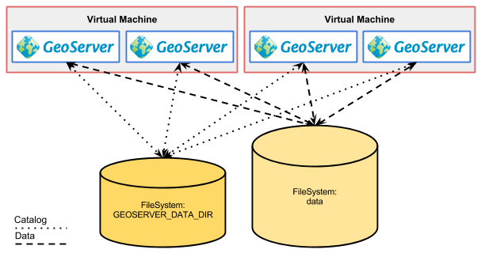
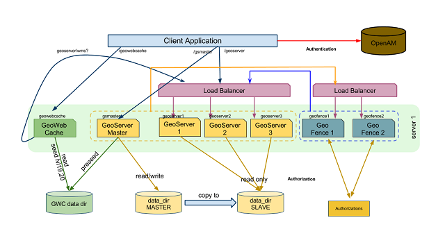
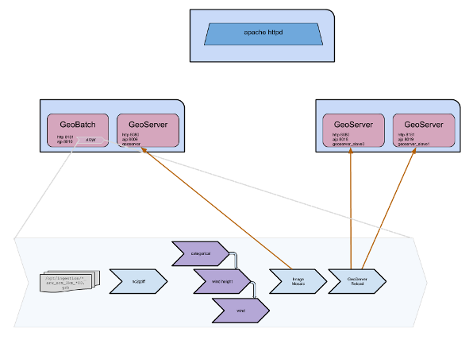

.. module:: introduction

.. _introduction:

Introduction
============

Objective of this document is to provide suggestions about how to best exploit the HW resources required with respect to the various software components of interests, namely, Apache Tomcat, GeoServer, and GeoWebCache in order to, on a side, implement an High Availability set up for each one of them to minimize the possibility of a service downtime and on the other side to achieve the maximum possible scalability in terms of number of concurrent requests that can be served for the unit of time with an acceptable response time. In the remaining part of this document we will assume that the reader possesses a decent knowledge of what the various software components do as well as the protocols they support. We will delve only into specifics related to the topic being discussed, that is properly dimensioning the deployment. In order to obtain reproducible numbers for the dimensioning of a host for GeoServer/GeoWebcache and Apache Tomcat capable to serve a certain number of concurrent requests, we have setup a 
test environment and launched different stress-test against it, in order to test its limits.

HA set up for GeoServer
-----------------------
Clustering GeoServer is required to implement an Highly Available set up as well as in order to achieve superior scalability. Regardless of the reason why one intends to create a clustered deployment for GeoServer there are a few limitations that must be taken into account and where possible worked around, let us now briefly introduce and discuss them.

   

GeoServer Limitations
---------------------

Data Directory
""""""""""""""
Currently the default persistence method for the internal configuration consists in a set of XML files contained inside a well-known directory called data directory (http://docs.geoserver.org/stable/en/user/datadirectory/data-dir-setting.html). This means that whenever we change the internal configuration and we persist the changes such changes are persisted in these XML files, moreover, whenever we need to load the internal configuration we need to read these files.

GeoServer comes with a built-in data directory. However, it is a good idea to separate the data from the application. Using an external data directory allows for much easier upgrades, since there is no risk of configuration information being overwritten. An external data directory also makes it easy to transfer your configuration elsewhere if desired. To point to an external data directory, you only need to edit the web.xml file. If you are new to GeoServer, you can copy (or just move) the data directory that comes with GeoServer to another location.

Following this, it becomes obvious that if we want to cluster multiple instances of GeoServer we must somehow share the same data directory in order to make sure that all the instances are identical. This can be achieved by either having the multiple instances share the same location for the GEOSERVER\_DATA\_DIR variable or to act at a lower level and use file system replication to keep different locations in synch.

Internal Configuration 
""""""""""""""""""""""
With the term GeoServer internal configuration we refer to the information that GeoServer manages and persists in order to perform its job. This information refers to, as an instance:

* Where the data is located
* How to connect to and serve the data
* How to manage incoming requests

and so on. Long story short, all the information that GeoServer needs for its proper working are represented within the internal configuration therefore every time we configure a new dataset or we change the way we want WMS to behave we interact with the internal configuration.

Logging Configuration
"""""""""""""""""""""
GeoServer’s logging subsystem is quite flexible as we can decide whether or not we log onto the output stream (which usually means the internal logging mechanism for the enclosing Application Server as well as the location of the specific GeoServer’s own log file where only the log coming from GeoServer is written.

By default GeoServer’s log location is relative to the data directory, however regardless of its location when multiple GeoServer share the same data directory it is crucial to instruct them to log to different locations, this can be achieved via the GEOSERVER\_LOG\_LOCATION configuration tweak as described here . Setting this environmental variable to different locations for each GeoServer instance (i.e. Java process) allows us to properly configure each of them to write to a different log file avoiding any problem.

Java2D Rasterizer Bottleneck
""""""""""""""""""""""""""""
Sun Java2D can rasterize only one shape at a time in the whole process when antialiasing is enabled OpenJDK can rasterize multiple in parallel, but it's very slow to use and not recommended for geoserver in production.

When generating images on server side in a concurrent environnement, worker threads are blocked most of the times so the application does not scale at all. As soon as mutiple clients request the generation of images, the response time increases.

The pipeline currently works by feeding the path to the renderer, then looping along getting chunks of "graybits" coverage values for each piece of the shape. Each chunk of "graybits" is then used to color the destination surface.

Most of this code is reentrant, but one critical piece is not - the code that creates a chunk of graybits from the digested path. Unfortunately, the existing implementation (which is running on 8-10 years old now) was written to use some fairly large internal data structures that were considered too expensive to create fresh for each renderer/thread.

when you have more than 4 CPU, and if you are normally CPU bound, setup multiple processes and use a load balancer to distribute the load among them.

References
""""""""""
http://bugs.sun.com/view_bug.do?bug_id=6508591
http://www.java.net/node/661354
http://forums.java.net/jive/thread.jspa?forumID=69&threadID=21275

Where the data is located
"""""""""""""""""""""""""
The spatial data accessed by GeoServer doesn’t need to reside within the GeoServer data directory, just pointers to the data locations. This should be obvious for data stored in spatial databases, which are certainly in different locations (on disk) and often on different machines; however the same is true for file-based spatial data and this can be problematic for a clustered GeoServer instances since depending on the approach taken for clustering such instances we need to ensure that both the data directory as well as the data it points to are mapped in a proper way on alla the machines for the various instances.

Integrated GeoWebCache Configuration
""""""""""""""""""""""""""""""""""""
Standard GeoServer comes with an integrated GeoWebCache instance to achieve map acceleration for tile based requests without the need for installing an additional piece of software. This capability is very good for small set up but can be problematic in larger set up where clustering is crucial (we will discuss why this happens in the next sections).

Residual limitations
""""""""""""""""""""
Once all of the above configuration changes are completed the cluster is ready for production. If nothing in the configuration ever changes, or changes only rarely, we’ve got a good production environment.

Backoffice/Production configuration (separate Data Directory)
=============================================================

When a cluster of geoserver with shared data directory is configured it’s advisable to setup an offline GeoServer working off a copy of the cluster data directory (staging area), make changes until a new satisfactory configuration layout is reached, and then propagate the changes to the production cluster with the following steps:

* Copy the data directory from the staging area to the production one
* Issue the “reload” REST configuration command on each node in the cluster so that the new configuration gets loaded on disk.

This approach starts showing its limitations when any of the following situations apply:

* Frequent configuration changes that need to be applied right away to the entire cluster
* The configuration contains many layers (hundreds or more) which implies a long reload time. During the reload phase the server is not really able to respond properly to OGC requests as the configuration is in an inconsistent and incomplete state

   
   
Master/Slave cluster with shared Data Directory
===============================================

To understand how a cluster of geoserver with shared data directory works, we have to explain how the configuration is actually handled.

In Memory Catalog
-----------------
Besides the fact that the internal configuration for GeoServer is stored by default in XML files, it is worth to point out that currently the persistence subsystem loads thoroughly in memory at start up ( or reload ) the entire internal configuration as it is defined inside the XML files in the data directory assuming, after that time, that the configuration resides actually in memory.

The infrastructure within the GeoServer codebase that manages the in memory copy of the internal configuration is called catalog (which should not be confused with the OGC concept of catalog) and contains the GeoServer’s internal object model where all the information of the internal configuration are represented by in memory java objects and relations; access to the catalog is guarded via specific locks from both the user interface as well as from the REST interface in order to ensure that proper access it it’s guaranteed in every moment.

Perform changes
---------------
Changing something into the catalog via the GUI or via the REST interface in this configuration is not a simple or atomic operation.
The fact that the internal catalog is kept pinned in memory by the GeoServer is relevant especially in a clustered environment since whenever a configuration change is made in one instance of GeoServer (the **master**) the other instances (the **slaves**) should not be aware of the change unless a full configuration reload is issued, moreover the internal configuration and catalog of GeoServer during a configuration reload is in an inconsistent state until when the loading has been performed and all the configuration objects have been created.

Along the same line it is worth to point out that when working with a cluster of GeoServer instances whenever we make a configuration change in an instance of the cluster we must reload the configuration of the other instances and this process becomes slower as we the configuration grows that is as more data is deployed.

