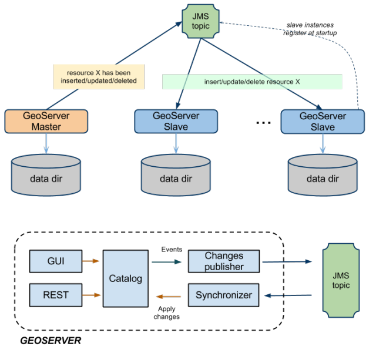

.. module:: geoserver.jms.index

.. _geoserver.jms.index:

JMS Clustering Extension
======================================

There exists various approaches with GeoServer to implement a clustered deployment, based on different mixes of data directory sharing plus configuration reload. However, these techniques have intrinsic limitations in terms of scalability therefore we decided to create a specific GeoServer Clustering Extension in order to overcome them. It is worth to point out that what we are going to describe is designed to work with GeoServer 2.4 stable series as well as with the 2.5.x. Our approach is shown in Illustration .

We have implemented a robust Master/Slave approach which leverages on a Message Oriented Middleware (MOM) where:
The Masters (yes, we can have more than one, read on...) accept changes to the internal configuration, persist them on their own data directory but also forward them to the Slaves via the MOM
The Slaves should not be used to change  their configuration from either REST or the User Interface, since are configured to inject configuration changes disseminated by the Master(s) via the MOM
The MOM is used to make the Master and the Slave exchange messages in a durable fashion
Each Slave has its own data directory and it is responsible for keeping it aligned with the Master's one. In case a Slave goes down when it goes up again he might receive a bunch of JMS messages to align its configuration to the Master's one.
A Node can be both Master and Slave at the same time, this means that we don't have a single point of failure, i.e. the Master itself

Summarizing, the Master as well as each Slave use a private data directory, Slaves receive changes from the Master, which is the only one where configuration changes are allowed, via JMS messages. Such messages transport GeoServer configuration objects that the Slaves inject directly in their own in-memory configuration and then persist on disk on their data directory, completely removing the need for a configuration reload for each configuration change.

ActiveMQ Broker Usage and Configuration as MOM
------------------------------------------------

We deliver a web application based on ActiveMQ which is preconfigured to be used with the GeoServer jms cluster module plugin as the MOM.
Additional information can be found a the links below

.. toctree:: 
   :maxdepth: 1

   activemq/activemqBroker
   activemq/JDBC
   activemq/SharedFolder
   
Building, Installing, Configuring and Using the JMS Clustering Extension
---------------------------------------------------------------------------

In the following sections we are going to talk about how build buid, install and use the JMS Clustering extension for GeoServer.

.. toctree:: 
   :maxdepth: 1

   installation
   
   

   
