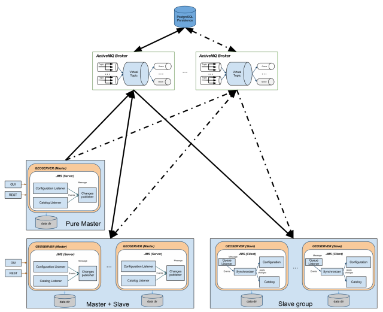
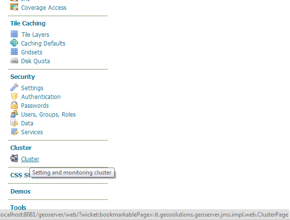
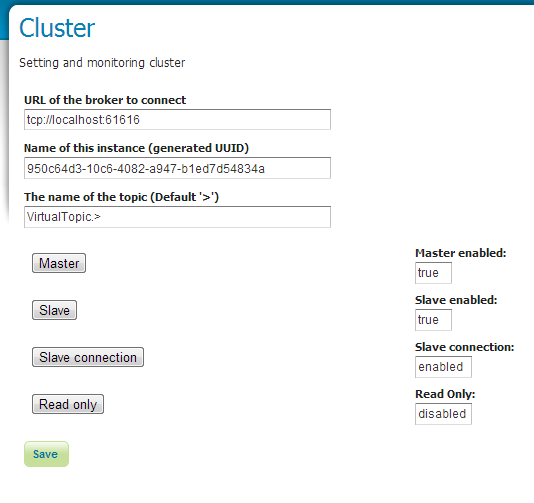
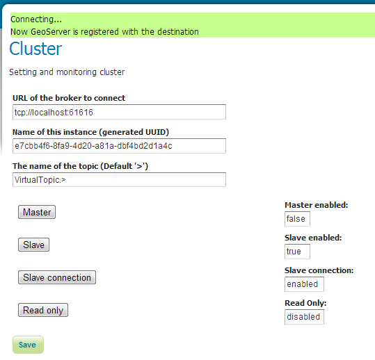
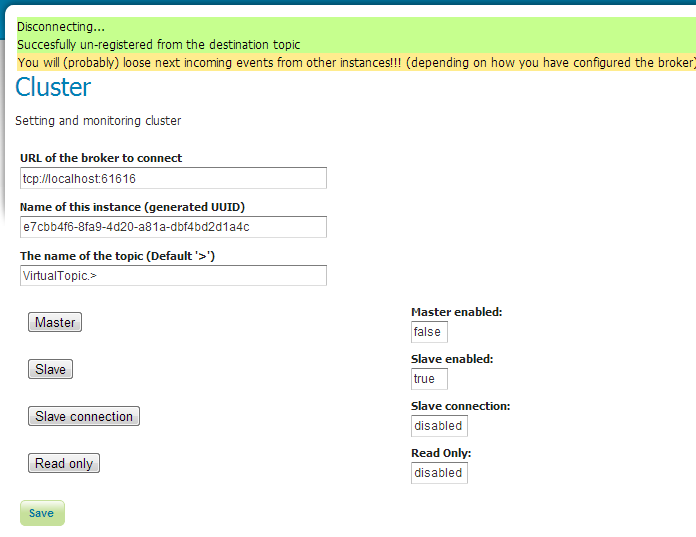

.. module:: geoserver.jms.installation

.. _geoserver.jms.installation:

Building and Installing the JMS Cluster modules
===============================================

Building
----------------------------

To build the standalone broker you only need to add the **activemq** profile to the maven command line:

.. code-block:: xml
  
  mvn clean install -Pactivemq
  
You'll get two distinct war:

The standalone ActiveMQ broker:

.. code-block:: xml
  
  ./community/cluster/activemqBroker/activemq_webapp/target/activemq.war

The geoserver including the cluster plugin:

.. code-block:: xml
  
  ./web/app/target/geoserver.war
  

To install the JMS Cluster modules you have to add some jars into the GeoServer's library folder (WEB-INF/libs) following the steps below.

GeoServer JMS Commons module
----------------------------

You need to add the following dependencies:

.. code-block:: xml

  jms-commons-2.4-ENTERPRISE-SNAPSHOT.jar
  jms-api-1.1-rev-1.jar
  xbean-spring-3.5.jar
  spring-jms-3.1.4.RELEASE.jar

Spring also need to be updated to 3.1.4.RELEASE :

.. code-block:: xml

  spring-aop-3.1.4.RELEASE.jar
  spring-tx-3.1.4.RELEASE.jar
  spring-beans-3.1.4.RELEASE.jar
  spring-core-3.1.4.RELEASE.jar
  spring-asm-3.1.4.RELEASE.jar
  spring-context-3.1.4.RELEASE.jar
  spring-context-support-3.1.4.RELEASE.jar
  spring-expression-3.1.4.RELEASE.jar
  spring-webmvc-3.1.4.RELEASE.jar
  spring-web-3.1.4.RELEASE.jar
  spring-tx-3.1.4.RELEASE.jar
  spring-jdbc-3.1.4.RELEASE.jar
  
**NOTE:**
  * Once you have added the above list of jars remember to remove the corresponding old jars (version 3.1.1.RELEASE)
  * Installing WPS also need to add **ant-1.7.1.jar**
  

While spring security can still remain the same:

.. code-block:: xml

  spring-security-core-3.1.0.RELEASE.jar
  spring-security-crypto-3.1.0.RELEASE.jar
  spring-security-web-3.1.0.RELEASE.jar
  spring-security-config-3.1.0.RELEASE.jar

GeoServer JMS module
--------------------

The Geoserver JMS module adds the following deps

.. code-block:: xml

  jms-geoserver-2.4-ENTERPRISE-SNAPSHOT.jar

GeoServer JMS ActiveMQ module
-----------------------------

The Geoserver JMS ActiveMQ module adds the following deps:

.. code-block:: xml

  jms-activeMQ-2.4-ENTERPRISE-SNAPSHOT.jar

plus ActiveMQ specific dependencies:

.. code-block:: xml

  activemq-all-5.8.0.jar
  activemq-amqp-5.8.0.jar
  activemq-broker-5.8.0.jar
  activemq-client-5.8.0.jar
  specs:geronimo-jms_1.1_spec-1.1.1.jar
  specs:geronimo-j2ee-management_1.1_spec-1.0.1.jar
  activemq-openwire-legacy-5.8.0.jar
  proton-jms-0.3.0-fuse-2.jar
  proton-0.3.0-fuse-2.jar
  proton-api-0.3.0-fuse-2.jar
  bcpkix-jdk15on-1.47.jar
  bcprov-jdk15on-1.47.jar
  hawtbuf-1.9.jar
  
Description of the JMS Clustering Extension
================================================

The GeoServer Master/slave integration is implemented using JMS, Spring and a MOM (Message Oriented Middleware), in particular ActiveMQ.
The schema in Illustration  represents a complete high level design of Master/Slave platform.
It is composed by 3 distinct actors:

1. GeoServer Masters
2. GeoServer Slaves
3. The MOM (ActiveMQ)

This structure allows to have:

1. Queue fail-over components (using MOM).
2. Slaves down are automatically handled using durable topic (which will keep missed message to re-synch changes happens during the slave down).
3. Master down will not affect any slave synchronization process.

This deployment is composed by:
A pure Master GeoServer(s), this instance can only send events to the topic.It cannot act as a slave
A set of Geoserver which can work as both Master and Slave. These instances can send and receive messages to/from the topic. They can work as Masters (sending message to other subscribers) as well as Slaves (these instances are also subscribers of the topic).
A set of pure Slaves GeoServer instances whic can only receive messages from the topic.
A set of MOM brokers so that each GeoServer instance is configured with a set of available brokers (failover). Each broker use the shared database as persistence. Doing so if a broker fails for some reason, messages can still be written and read from the shared database.

All the produced code is based on spring-jms to ensure portability amongs different MOM, but if you look at the schema, we are also leveraging ActiveMQ VirtualTopics to get dinamic routing (you can dinamically attach masters and slaves).

The VirtualTopics feature has also other advantages explained here http://activemq.apache.org/virtual-destinations.html

Implementation
--------------
The comunity plugin is composed by 3 different modules (plus one which can be used as external broker):

1. jms-commons
2. jms-geoserver
3. jms-activeMQ
4. activemqBroker

jms-commons
^^^^^^^^^^^

Contains only the low level definition of all the used interface.
Depends from Spring JMS.

jms-geoserver
^^^^^^^^^^^^^

Is the geoserver cluster core plugin, it implements the Master and the Slave and all the needed GeoServer event listeners (currently this is done for configuration and catalog).
Define a set of classes and methods to serialize or wrap those events to produce valid JMS messages.
For each incoming event type the module will apply the assigned method (from the above set) obtaining a valid JMS message which are sent to a durable topic queue.
The messages from the topic can be consumed by a set of classes and methods to perform message de-serialization accordingly to the incoming message type and properties.
For each incoming message the module will apply the assigned method (from the above set) obtaining a valid Object (f.e.: CatalogEvent).
The object will be used to apply changes to the target component (for instance the configuration or the catalog).
It also ships an GUI interface to handle the various components and to check the status
Depends from geoserver and the jms-commons module.

jms-activemq
^^^^^^^^^^^^

Is a the activeMQ implementation of a factory used to instantiate the needed JMS components (essentially 2 Destination and 1 Connection).
Depends from ActiveMQ and jms-commons.

It is however possible as indicated above that an instance of  GeoServer would work both as master as well as Slave (looking at events coming from other GeoServer(s)). This is useful to setup a multimaster enviroment that allows the modification to keep flowing even in face of failure of one of the masters (using a failover approach).

Limitations and future extensions
^^^^^^^^^^^^^^^^^^^^^^^^^^^^^^^^^

Data
++++

NO DATA IS SENT THROUGH THE JMS CHANNEL

The clustering solution we have put in place is specific for managing the GeoServer internal configuration, no data is transferred between master and slaves. For that purpose use external mechanisms (ref. [GeoServer REST]). 

In principle this is not a limitation per se since usually in a clustered environment data is stored in shared locations outside the data directory. With our solution this is a requirement since each slave will have its own private data directory.

Events
++++++
* NEVER RELOAD THE GEOSERVER CATALOG ON A MASTER
  Each master instance should never call the catalog reload since this propagates the creation of all the resources, styles, etc to all the connected slaves.
* NEVER CHANGE CONFIGURATION USING A PURE SLAVE
  This will make the configuration of the specific slave out of synch with the others.  

Configuration of the JMS Cluster
================================

Each geoserver instance with the JMS cluster plugin installed starts with a prebuilt set of preferences.

The configuration is quite simple and can be performed using the provided GUI or modifying the cluster.properties file.

When the geoserver starts, it automatically populates the configuration file cluster.properties which will be stored into the GEOSERVER_DATA_DIR under the cluster folder (${GEOSERVER_DATA_DIR}/cluster).

To override the default destination of this configuration file you have to setup the **CLUSTER_CONFIG_DIR** variable defining the destination folder of the **cluster.properties** file. This is useful when you want to share the same GEOSERVER_DATA_DIR (which is not needed with geoserver cluster with JMS extensions).

Into the standalone package you may found the cluster.settings under:

.. code-block:: xml

  ${TRAINING_ROOT}/data/cluster/instanceX/cluster.properties
  
  
Here is an example of its content (automatically generated):

.. code-block:: xml

  #
  #Wed Sep 18 16:21:09 GMT 2013
  brokerURL=tcp\://localhost\:61616
  instanceName=950c64d3-10c6-4082-a947-b1ed7d54834a
  connection=disabled
  topicName=VirtualTopic.>
  CLUSTER_CONFIG_DIR=C\:\\DEMO\\Training_2.4_cluster-1.1_Win64\\\\data\\cluster\\instance1
  toggleSlave=true
  toggleMaster=true
  readOnly=disabled

The GUI
-------

To access to the GUI setting page, login into geoserver and click on the clustering menu:

The setting page will be shown as below:

Name of this instance
^^^^^^^^^^^^^^^^^^^^^
The **instanceName** is used to distinguish from which GeoServer instance the message is coming from, so each GeoServer instance should use a different, unique (for a single cluster) name.

URL of the broker
^^^^^^^^^^^^^^^^^
The **brokerURL** field is used to instruct the internal JMS machinery where to publish messages to (master GeoServer installation) or where to consume messages from (slave GeoServer installation). Many options are available for configuring the connection between the GeoServer instance and the JMS broker, for a complete list, please, check this link. In case when (recommended) failover set up  is put in place multiple broker URLs can be used: please, check this link for more information about how to configure that.

Slave connection
^^^^^^^^^^^^^^^^

The slave connection button try to connect the geoserver instance to the Broker as client.

Clicking on it you will try to connect to the external ActiveMQ broker:

   
When you connect the first time to the broker the instance name is registered as consumer and all the messages sent to the broker will be stored to a storage, so, if your geoserver may go down of you disconnect for any reason, on reconnection all the messages will be retrieved. Note that with the default setting the broker stores the client registration for 1 day.
   
 Disabling connection:

  
In case of connection failure:
  
  .. figure:: images/Clustering_slave_connection_fails.png
   :align: center
   :alt: Illustration: JMS GUI clustering connection fails

Master
^^^^^^

This button sets the geoserver as master, this means that each change made to the settings or the catalog of this instance will be reproduced with all the registered slaves.

Slave
^^^^^

This button sets the geoserver as slave, this means that each change made by any master geoserver in the cluster will be applied into this instance.

Read only
^^^^^^^^^

Enable the **ReadOnly** mode. When true the geoserver instance will not persists changes to the catalog and settings on the disk (changes are only applied in memory). This can be useful if you still whant to share the GEOSERVER_DATA_DIR (which is not needed by this cluster configuration).

  